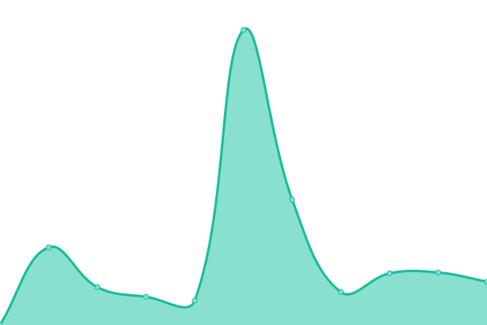

# [📈 Live Status](https://status.veloren.net): <!--live status--> **🟩 All systems operational**

This repository contains the open-source uptime monitor and status page for [veloren](https://www.veloren.net), powered by [Upptime](https://github.com/upptime/upptime).

With [Upptime](https://upptime.js.org), you can get your own unlimited and free uptime monitor and status page, powered entirely by a GitHub repository. We use [Issues](https://github.com/veloren/status.veloren.net/issues) as incident reports, [Actions](https://github.com/veloren/status.veloren.net/actions) as uptime monitors, and [Pages](https://status.veloren.net) for the status page.

<!--start: status pages-->
<!-- This summary is generated by Upptime (https://github.com/upptime/upptime) -->
<!-- Do not edit this manually, your changes will be overwritten -->
<!-- prettier-ignore -->
| URL | Status | History | Response Time | Uptime |
| --- | ------ | ------- | ------------- | ------ |
|  [Game Server](server.veloren.net) | 🟩 Up | [game-server.yml](https://github.com/veloren/status.veloren.net/commits/HEAD/history/game-server.yml) | 

 163ms
     
 | 

<a href="https://status.veloren.net/history/game-server">100.00%</a>
    

|  [Website](https://veloren.net) | 🟩 Up | [website.yml](https://github.com/veloren/status.veloren.net/commits/HEAD/history/website.yml) | 

 496ms
     
 | 

<a href="https://status.veloren.net/history/website">100.00%</a>
    

|  [Auth](https://auth.veloren.net/ping) | 🟩 Up | [auth.yml](https://github.com/veloren/status.veloren.net/commits/HEAD/history/auth.yml) | 

 545ms
     
 | 

<a href="https://status.veloren.net/history/auth">100.00%</a>
    

|  [Book](https://book.veloren.net) | 🟩 Up | [book.yml](https://github.com/veloren/status.veloren.net/commits/HEAD/history/book.yml) | 

 1183ms
     
 | 

<a href="https://status.veloren.net/history/book">99.46%</a>
    

|  [Wiki](https://wiki.veloren.net) | 🟩 Up | [wiki.yml](https://github.com/veloren/status.veloren.net/commits/HEAD/history/wiki.yml) | 

 935ms
     
 | 

<a href="https://status.veloren.net/history/wiki">100.00%</a>
    

|  [Grafana](https://grafana.veloren.net) | 🟩 Up | [grafana.yml](https://github.com/veloren/status.veloren.net/commits/HEAD/history/grafana.yml) | 

 774ms
     
 | 

<a href="https://status.veloren.net/history/grafana">100.00%</a>
    

|  [CDN](https://download.veloren.net) | 🟩 Up | [cdn.yml](https://github.com/veloren/status.veloren.net/commits/HEAD/history/cdn.yml) | 

 537ms
     
 | 

<a href="https://status.veloren.net/history/cdn">100.00%</a>
    

<!--end: status pages-->

[**Visit our status website →**](https://status.veloren.net)

## 📄 License

- Powered by: [Upptime](https://github.com/upptime/upptime)
- Code: [MIT](./LICENSE) © [veloren](https://www.veloren.net)
- Data in the `./history` directory: [Open Database License](https://opendatacommons.org/licenses/odbl/1-0/)
